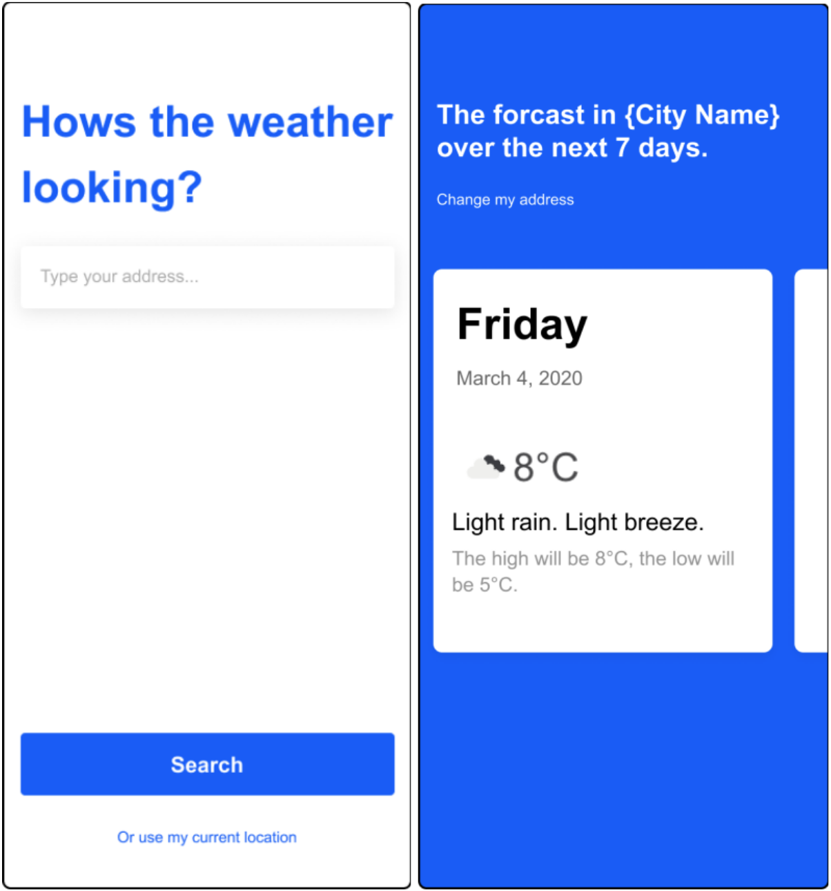

# Wagestream Code Assessment (Android)

## Overview

This code assessment is specifically designed for mobile app developers.

The goal of this task is to assess your development and architecture design skills.

Please complete this task in the framework specified by your recruitment manager

## Assessment requirements

For this task you must implement the following features as you can. We favor quality
over quantity.

You are welcome to use any external libraries that make the development of your app
faster and more elegant.

## App overview

For this task you will be required to build a basic weather app. Please follow the UI & UX design
screens provided and ensure it remains as close to design as possible.

### Feature list

1. Search by city name or post code - Implement search functionality to allow the
   user to enter a city name or post code. Please display search results in a
   selectable drop down menu.
2. Most recent search location loads automatically - When you come back to the
   app after closing it, the weather for the most recent search should be displayed.
3. Recent searches - Implement a screen that lists recently searched locations. You
   can tap on a recent search location and see the current weather location.
4. Delete recent searches - Provide the ability to delete one or more recent
   searches.
5. Search by GPS (optional / low priority) - Allow users to use current GPS location
   as an alternative, to get the current weather information.

### Hard Requirements
- Use the OpenWeatherMap API: https://openweathermap.org/api. You may use any of json, xml, or
  another payload. - You may create your own API key or use this one
  `951d425b0ddcd27b3672070b4d60ccd9`
- Please do not use the map solution provided by openweathermap.org
- For the city/postcode search feature you can assume that the app is Australia-only
- Code should be testable
- (Optional) one of the features should be covered by unit tests

### Submission

- Provide a link to a GitHub repo
- Be prepared to speak about the choices you make across the board such as code, design, choice of
  libraries, test coverage, use of UI paradigms, etc.

## UI & UX Screens

Screen 1 & Screen 2

